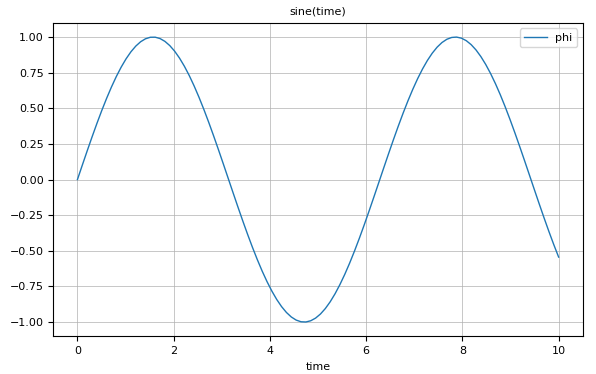
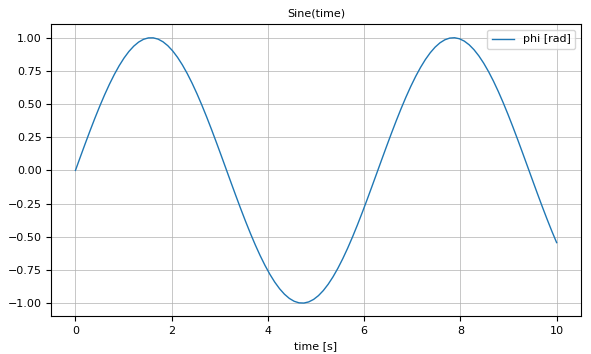
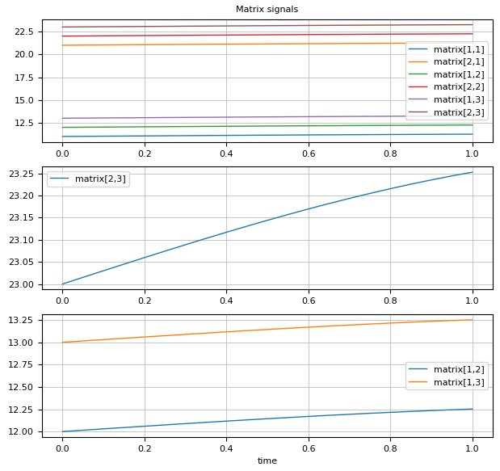

# Plot Examples

```@meta
CurrentModule = SignalTables
```


## OneScalarSignal

```julia
using SignalTables
@usingPlotPackage 
   
t = range(0.0, stop=10.0, length=100)

sigTable = SignalTable(
    "time" => Var(values = t, independent=true),
    "phi"  => Var(values = sin.(t))
)

showInfo(sigTable)
plot(sigTable, "phi", heading="sine(time)")
``` 

results  in:

```julia
 name  unit  size    eltypeOrType  kind  attributes
──────────────────────────────────────────────────────────
 time        (100,)  Float64       Var   independent=true
 phi         (100,)  Float64       Var
```




## OneScalarSignalWithUnit

```julia
using SignalTables
@usingPlotPackage 
   
t = range(0.0, stop=10.0, length=100)

sigTable = SignalTable(
    "time" => Var(values = t, unit="s", independent=true),
    "phi"  => Var(values = sin.(t), unit="rad")
)

showInfo(sigTable)
plot(sigTable, "phi", heading="sine(time)")
``` 

results  in:

```julia
 name  unit   size    eltypeOrType  kind  attributes
───────────────────────────────────────────────────────────
 time  "s"    (100,)  Float64       Var   independent=true
 phi   "rad"  (100,)  Float64       Var
```




## OneVectorSignalWithUnit

```julia
using SignalTables
@usingPlotPackage 
   
t = range(0.0, stop=10.0, length=100)

sigTable = SignalTable(
    "time" => Var(values = t, unit="s", independent=true),
    "r"    => Var(values = [0.4*cos.(t)  0.5*sin.(t)  0.3*cos.(t)], unit="m"),
)

showInfo(sigTable)
plot(sigTable, "phi", heading="sine(time)")
``` 

results  in:

```julia
 name  unit  size     eltypeOrType  kind  attributes
───────────────────────────────────────────────────────────
 time  "s"   (100,)   Float64       Var   independent=true
 r     "m"   (100,3)  Float64       Var
```


## OneMatrixSignal

```julia
using SignalTables
@usingPlotPackage 
   
t = range(0.0, stop=1.0, length=10)

offset  = Float64[11  12  13;
                  21  22  23]
matrix = Array{Float64,3}(undef,length(t),2,3)
for i = 1:length(t), j = 1:2, k=1:3
    matrix[i,j,k] = offset[j,k] + 0.3*sin(t[i])
end
    
sigTable = SignalTable(   
    "time"   => Var(values = t, independent=true),
    "matrix" => Var(values = matrix)
)

showInfo(sigTable)
plot(sigTable, "phi", heading="sine(time)")
``` 

results  in:

```julia
 name    unit  size      eltypeOrType  kind  attributes
──────────────────────────────────────────────────────────────
 time          (10,)     Float64       Var   independent=true
 matrix        (10,2,3)  Float64       Var
```




## OneMatrixSignalWithMatrixUnits

```julia
using SignalTables
@usingPlotPackage 
   
t = range(0.0, stop=1.0, length=10)

offset  = Float64[11  12  13;
                  21  22  23]
matrix = Array{Float64,3}(undef,length(t),2,3)
for i = 1:length(t), j = 1:2, k=1:3
    matrix[i,j,k] = offset[j,k] + 0.3*sin(t[i])
end
    
sigTable = SignalTable(   
    "time"   => Var(values = t, unit="s", independent=true),
    "matrix" => Var(values = matrix, unit=["m"   "m/s"   "m/s^2";
                                           "rad" "rad/s" "rad/s^2"])
)

showInfo(sigTable)
plot(sigTable, "phi", heading="sine(time)")
``` 

results  in:

```julia
 name    unit                                          size      eltypeOrType  kind  attributes
──────────────────────────────────────────────────────────────────────────────────────────────────────
 time    "s"                                           (10,)     Float64       Var   independent=true
 matrix  ["m" "m/s" "m/s^2"; "rad" "rad/s" "rad/s^2"]  (10,2,3)  Float64       Var
```


## ConstantSignals

```julia
using SignalTables
@usingPlotPackage 
   
t = range(0.0, stop=1.0, length=5)

matrix = Float64[11  12  13;
                 21  22  23]
                            
sigTable = SignalTable(
    "time"    => Var(values = t, unit="s", independent=true),
    "phi_max" => Par(value = 1.1f0, unit="rad"),
    "i_max"   => Par(value = 2),
    "open"    => Par(value = true),
    "file"    => Par(value = "filename.txt"),
    "matrix1" => Par(value = matrix),
    "matrix2" => Par(alias = "matrix1", unit="m/s"),
    "matrix3" => Par(alias = "matrix1", unit=["m"   "m/s"   "m/s^2";
                                              "rad" "rad/s" "rad/s^2"])
)

showInfo(sigTable)
plot(sigTable, "phi", heading="sine(time)")
``` 

results  in:

```julia
 name     unit                                          size   eltypeOrType  kind  attributes
────────────────────────────────────────────────────────────────────────────────────────────────────
 time     "s"                                           (5,)   Float64       Var   independent=true
 phi_max  "rad"                                         ()     Float32       Par
 i_max                                                  ()     Int64         Par
 open                                                   ()     Bool          Par
 file                                                          String        Par
 matrix1                                                (2,3)  Float64       Par
 matrix2  "m/s"                                         (2,3)  Float64       Par   alias="matrix1"
 matrix3  ["m" "m/s" "m/s^2"; "rad" "rad/s" "rad/s^2"]  (2,3)  Float64       Par   alias="matrix1"
```


# MissingValues

```julia
using SignalTables
@usingPlotPackage 
   
time1 =  0.0 : 0.1 : 3.0
time2 =  3.0 : 0.1 : 11.0
time3 = 11.0 : 0.1 : 15
t     = vcat(time1,time2,time3)   
sigC  = vcat(fill(missing,length(time1)), 0.6*cos.(time2.+0.5), fill(missing,length(time3)))

function sigD(t, time1, time2)
    sig = Vector{Union{Missing,Float64}}(undef, length(t))
    
    j = 1
    for i = length(time1)+1:length(time1)+length(time2)
        if j == 1 
            sig[i] = 0.5*cos(t[i])
        end
        j = j > 3 ? 1 : j+1
    end
    return sig
end

sigTable = SignalTable(
    "time"   => Var(values=t, unit="s", independent=true),
    "load.r" => Var(values=0.4*[sin.(t) cos.(t) sin.(t)], unit="m"),  
    "sigA"   => Var(values=0.5*sin.(t), unit="m"),
    "sigB"   => Var(values=1.1*sin.(t), unit="m/s"),
    "sigC"   => Var(values=sigC, unit="N*m"),
    "sigD"   => Var(values=sigD(t, time1, time2), unit="rad/s", variability="clocked", info="Motor angular velocity")  
) 

showInfo(sigTable)
plot(sigTable, [("sigC", "load.r[2:3]"), ("sigB", "sigD")])
``` 

results  in:

```julia
 name    unit     size     eltypeOrType            kind  attributes
─────────────────────────────────────────────────────────────────────────────────────────────────────────────
 time    "s"      (153,)   Float64                 Var   independent=true
 load.r  "m"      (153,3)  Float64                 Var
 sigA    "m"      (153,)   Float64                 Var
 sigB    "m/s"    (153,)   Float64                 Var
 sigC    "N*m"    (153,)   Union{Missing,Float64}  Var
 sigD    "rad/s"  (153,)   Union{Missing,Float64}  Var   variability="clocked", info="Motor angular velocit…
```


 
# VariousTypes

```julia
using SignalTables
@usingPlotPackage 
   
t = 0.0:0.1:0.5
sigTable = SignalTable(
"time"        => Var(values= t, unit="s", independent=true),
"load.r"      => Var(values= [sin.(t) cos.(t) sin.(t)], unit="m"),
"motor.angle" => Var(values= sin.(t), unit="rad", state=true),
"motor.w"     => Var(values= cos.(t), unit="rad/s", integral="motor.angle"),
"motor.w_ref" => Var(values= 0.9*[sin.(t) cos.(t)], unit = ["rad", "1/s"],
                            info="Reference angle and speed"),
"wm"          => Var(alias = "motor.w"),
"ref.clock"   => Var(values= [true, missing, missing, true, missing, missing],
                                variability="clock"),
                                
"motor.w_c"   => Var(values= [0.6, missing, missing, 0.8, missing, missing],
                            variability="clocked", clock="ref.clock"),

"motor.inertia" => Par(value = 0.02f0, unit="kg*m/s^2"),
"motor.data"    => Par(value = "resources/motorMap.json"),
"attributes"    => Par(info  = "This is a test signal table")
)

showInfo(sigTable)
plot(sigTable, ["load.r", ("motor.w", "wm", "motor.w_c", "ref.clock")], heading="VariousTypes")
``` 

results  in:

```julia
 name           unit            size   eltypeOrType            kind  attributes
──────────────────────────────────────────────────────────────────────────────────────────────────────────────
 time           "s"             (6,)   Float64                 Var   independent=true
 load.r         "m"             (6,3)  Float64                 Var
 motor.angle    "rad"           (6,)   Float64                 Var   state=true, der="motor.w"
 motor.w        "rad/s"         (6,)   Float64                 Var
 motor.w_ref    ["rad", "1/s"]  (6,2)  Float64                 Var   info="Reference angle and speed"
 wm             "rad/s"         (6,)   Float64                 Var   alias="motor.w"
 ref.clock                      (6,)   Union{Missing,Bool}     Var   variability="clock"
 motor.w_c                      (6,)   Union{Missing,Float64}  Var   variability="clocked", clock="ref.clock"
 motor.inertia  "kg*m/s^2"      ()     Float32                 Par
 motor.data                            String                  Par
 attributes                                                    Par   info="This is a test signal table"
```


