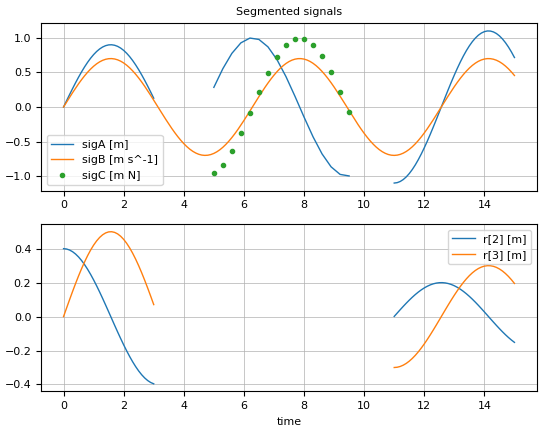

# SignalTables Documentation

```@meta
CurrentModule = SignalTables
```

## Overview

Package [SignalTables](https://github.com/ModiaSim/SignalTables.jl)
provides abstract and concrete types and functions for *signal tables*.
Typically, simulation results, reference signals, table-based input signals, measurement data,
look-up tables can be represented by a signal table.

A *signal table* is an *ordered dictionary* of *signals* with string keys that supports the
[Abstract Signal Table Interface](https://modiasim.github.io/SignalTables.jl/stable/Internal/AbstractSignalTableInterface.html). 
A *signal* can be defined in two forms:

- As [Var](https://modiasim.github.io/SignalTables.jl/stable/Functions/Signals.html#SignalTables.Var) *dictionary* that has a required *values* key representing a *signal array* of any element type as function of the independent signal(s) (or is the k-th independent signal). A *signal array* is a *multi-dimensional array* with indices `[i1,i2,...,j1,j2,...]` to hold variable elements `[j1,j2,...]` at the `[i1,i2,...]` independent signal(s). If an element of a signal array is *not defined*, it has a value of *missing*.
- As [Par](https://modiasim.github.io/SignalTables.jl/stable/Functions/Signals.html#SignalTables.Par) *dictionary* that has an optional *value* key representing a constant of any type.

In both dictionaries, additional attributes can be stored, for example *unit*, *info*, *variability* (continuous, clocked, ...), *alias*, *interpolation*, *extrapolation*, and user-defined attributes.

## Examples

```julia
using SignalTables

t = 0.0:0.1:0.5
sigTable = SignalTable(
  "time"        => Var(values= t, unit="s", independent=true),
  "load.r"      => Var(values= [sin.(t) cos.(t) sin.(t)], unit="m"),
  "motor.angle" => Var(values= sin.(t), unit="rad", state=true),
  "motor.w"     => Var(values= cos.(t), unit="rad/s", integral="motor.angle"),
  "motor.w_ref" => Var(values= 0.9*[sin.(t) cos.(t)], unit = ["rad", "1/s"],
                               info="Reference angle and speed"),
  "wm"          => Var(alias = "motor.w"),
  "ref.clock"   => Var(values= [true, missing, missing, true, missing, missing],
                                variability="clock"),
                                
  "motor.w_c"   => Var(values= [0.8, missing, missing, 1.5, missing, missing],
                               variability="clocked", clock="ref.clock"),

  "motor.inertia" => Par(value = 0.02f0, unit="kg*m/s^2"),
  "motor.data"    => Par(value = "resources/motorMap.json"),
  "attributes"    => Par(info  = "This is a test signal table")
)

phi_m_sig = getSignal(        sigTable, "motor.angle")   # = Var(values=..., unit=..., ...)
phi_m     = getValuesWithUnit(sigTable, "motor.angle")   # = [0.0, 0.0998, 0.1986, ...]u"rad"
w_c       = getValues(        sigTable, "motor.w_c"  )   # = [0.8, missing, missing, 1.5, ...]
inertia   = getValueWithUnit( sigTable, "motor.inertia") # = 0.02u"kg*m/s^2"
getValues(sigTable, "motor.w") === getValues(sigTable, "wm")

showInfo(sigTable)
```

Command `showInfo` generates the following output:

```julia
name          unit           size  eltypeOrType           kind attributes
───────────────────────────────────────────────────────────────────────────────────────────────────────
time          "s"            (6,)  Float64                Var  independent=true
load.r        "m"            (6,3) Float64                Var
motor.angle   "rad"          (6,)  Float64                Var  state=true, der="motor.w"
motor.w       "rad/s"        (6,)  Float64                Var
motor.w_ref   ["rad", "1/s"] (6,2) Float64                Var  info="Reference angle and speed"
wm            "rad/s"        (6,)  Float64                Var  alias="motor.w"
ref.clock                    (6,)  Union{Missing,Bool}    Var  variability="clock"
motor.w_c                    (6,)  Union{Missing,Float64} Var  variability="clocked", clock="ref.clock"
motor.inertia "kg*m/s^2"     ()    Float32                Par
motor.data                         String                 Par
attributes                                                Par  info="This is a test signal table"
```

The various Julia FileIO functions can be directly used to save a signal table
in various formats, e.g. JSON or HDF5 (see [FileIO Examples](@ref), [json file of sigTable above](../resources/examples/fileIO/VariousTypes_prettyPrint.json) ).

The commands

```julia
using SignalTable
usePlotPackage("PyPlot")    # or ENV["SignalTablesPlotPackage"] = "PyPlot"

sigTable = getSignalTableExample("MissingValues")

@usingPlotPackage           # = using SignalTablesInterface_PyPlot
plot(sigTable, [("sigC", "load.r[2:3]"), ("sigB", "sigD")])
```

generate the following plot:




## Abstract Interfaces

*Concrete implementations* of the [Abstract Signal Table Interface](@ref) are provided for:

- [`SignalTable`](@ref) (included in SignalTables.jl).

- [Modia.jl](https://github.com/ModiaSim/Modia.jl) (a modeling and simulation environment; version >= 0.9.0)

- [DataFrames.jl](https://github.com/JuliaData/DataFrames.jl)
  (tabular data; first column is independent variable; *only scalar variables*))

- [Tables.jl](https://github.com/JuliaData/Tables.jl)
  (abstract tables, e.g. [CSV](https://github.com/JuliaData/CSV.jl) tables;
  first column is independent variable; *only scalar variables*).

*Concrete implementations* of the [Abstract Plot Interface](@ref) are provided for:

- [PyPlot](https://github.com/JuliaPy/PyPlot.jl) (plots with [Matplotlib](https://matplotlib.org/stable/) from Python;
  via [SignalTablesInterface_PyPlot.jl](https://github.com/ModiaSim/SignalTablesInterface_PyPlot.jl)),

Planned implementations (basically adapting from [ModiaResult.jl](https://github.com/ModiaSim/ModiaResult.jl)):

- [GLMakie](https://github.com/JuliaPlots/GLMakie.jl) (interactive plots in an OpenGL window),
- [WGLMakie](https://github.com/JuliaPlots/WGLMakie.jl) (interactive plots in a browser window),
- [CairoMakie](https://github.com/JuliaPlots/CairoMakie.jl) (static plots on file with publication quality).

Furthermore, there is a dummy implementation included in SignalTables.jl that is useful when performing tests with runtests.jl,
in order that no plot package needs to be loaded during the tests:

- SilentNoPlot (= all plot calls are silently ignored).


## Installation

```julia
julia> ]add SignalTables
        add SignalTablesInterface_PyPlot        # if plotting with PyPlot desired
        
        # once registered
        add SignalTablesInterface_GLMakie       # if plotting with GLMakie desired
        add SignalTablesInterface_WGLMakie      # if plotting with WGLMakie desired
        add SignalTablesInterface_CairoMakie    # if plotting with CairoMakie desired
```

If you have trouble installing `SignalTablesInterface_PyPlot`, see
[Installation of PyPlot.jl](https://modiasim.github.io/SignalTables.jl/stable/index.html#Installation-of-PyPlot.jl)


## Installation of PyPlot.jl

`SignalTablesInterface_PyPlot.jl` uses `PyPlot.jl` which in turn uses Python.
Therefore a Python installation is needed. Installation
might give problems in some cases. Here are some hints what to do
(you may also consult the documentation of [PyPlot.jl](https://github.com/JuliaPy/PyPlot.jl)).

Before installing `SignalTablesInterface_PyPlot.jl` make sure that `PyPlot.jl` is working:

```julia
]add PyPlot
using PyPlot
t = [0,1,2,3,4]
plot(t,2*t)
```

If the commands above give a plot window. Everything is fine.

If you get errors or no plot window appears or Julia crashes,
try to first install a standard Python installation from Julia:

```julia
# Start a new Julia session
ENV["PYTHON"] = ""    # Let Julia install Python
]build PyCall
exit()   # Exit Juila

# Start a new Julia session
]add PyPlot
using PyPlot
t = [0,1,2,3,4]
plot(t,2*t)
```

If the above does not work, or you want to use another Python distribution,
install a [Python 3.x distribution](https://wiki.python.org/moin/PythonDistributions) that contains Matplotlib,
set `ENV["PYTHON"] = "<path-above-python-installation>/python.exe"` and follow the steps above.
Note, `SignalTablesInterface_PyPlot` is based on the Python 3.x version of Matplotlib where some keywords
are different to the Python 2.x version.


## Release Notes

### version 0.3.2

- Add makie.jl to be used by Makie backends.
- For backwards compatibilty to ModiaResult, also accept ENV["MODIA_PLOT_PACKAGE"] instead of ENV["SignalTablesPlotPackage"]
  to define plot package - at all places (some parts have been missing).
  

### Version 0.3.1

- writeSignalTable(..): Do not store elements, that cannot be mapped to JSON + add _classVersion to signal table on file.
- For backwards compatibilty to ModiaResult, also accept ENV["MODIA_PLOT_PACKAGE"] instead of ENV["SignalTablesPlotPackage"]
  to define plot package.


### Version 0.3.0

- Slightly non-backwards compatiable to 0.2.0.
- Various new functions (e.g. storing a signal table in JSON format on file).
- DataFrames.jl, Tables.jl are supported as signal tables.
- Plotting/flattening: Support of Measurements.jl and MonteCarloMeasurements.jl
- Docu improved.
- Bug with PlotPackage "SilentNoPlot" fixed.
- `SignalTables/test/runtests.jl` runs the tests with plot package *"SilentNoPlot"* (instead of the activated plot package).
- New file `SignalTables/test/runtests_with_plot.jl` runs the tests with the activated plot package.


### Version 0.2.0

Version, based on [ModiaResult.jl](https://github.com/ModiaSim/ModiaResult.jl).
Changes with respect to ModiaResult.jl:

Underlying data format made much simpler, more general and more useful:

- Dictionary of *multi-dimensional arrays* as function of one or more independent variables
  with potentially *missing values*.
- Also parameters can be stored in the dictionary and are supported, e.g., for plotting.
- Variables and parameters are dictionaries that store the actual values (e.g. arrays), and additional attributes.
- Values are stored without units and the units are provided via the additional string attribute `:unit`. A unit can be 
  either hold for all elements of an array, or an array of units can be provided defining the units for all variable elements.
- A new function to *flatten* and convert a signal array for use in plots or traditional tables.
- Since signals are arrays, all the Julia array operations can be directly used,
  e.g. for post-processing of simulation results.
- write/save on JSON and JDL (HDF5) files.

Furthermore

- Documentation considerably improved and made more user-oriented.
- The Abstract Interfaces defined more clearly.
- Several annoying bugs of ModiaResult.jl are no longer present.

### Version 0.1.0

Initial version used for registration.


## Main developer

[Martin Otter](https://rmc.dlr.de/sr/en/staff/martin.otter/),
[DLR - Institute of System Dynamics and Control](https://www.dlr.de/sr/en)

